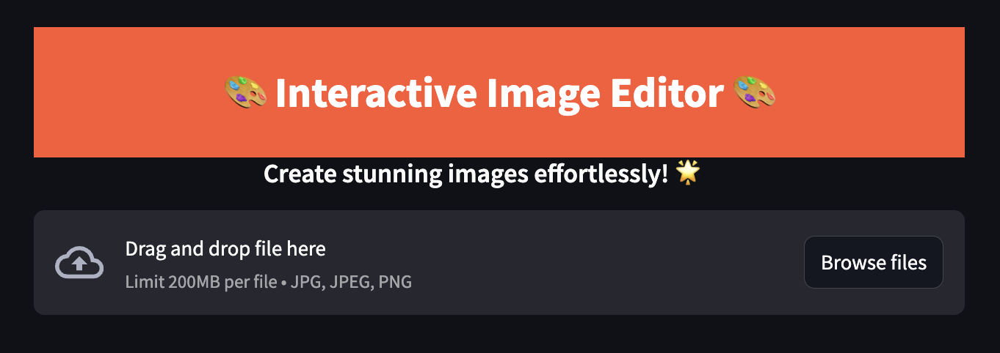

# 🎨 Interactive Image Editor App

🎉 Introducing **Interactive Image Editor**! 

With this easy-to-use, web-based editor, you can quickly enhance, crop, and customize your images with a few clicks—all from your browser.



## 📸 Features

- **Image Upload**: Supports `JPEG`, `PNG`, and `JPG` formats.
- **Flip and Rotate**: Quickly adjust orientation with mirroring and rotation tools.
- **Grid Overlay**: Includes a helpful Rule of Thirds overlay for perfect composition.
- **Aspect Ratio Crop**: Crop images to custom aspect ratios with a draggable crop box.
- **Quality Adjustments**: Control output quality and file size to suit your needs.
- **File Download Options**: Save as JPEG, PNG, or PDF with selected width.

## 🌟 Getting Started

### Prerequisites
- [Python](https://www.python.org/downloads/)
- [Streamlit](https://docs.streamlit.io/)

### Installation
1. Clone the repository(WIP):
   ```bash
   git clone https://github.com/DenimPatel/Image-editor.git
   ```
2. Install dependencies(WIP):
   ```bash
   pip install -r requirements.txt
   ```

3. Run the app:
   ```bash
   streamlit run app.py
   ```

## 🚀 Usage

1. **Upload Your Image**: Click "Upload an Image" to select your file.
2. **Edit with Ease**: Apply mirror, rotation, or cropping adjustments as needed.
3. **Download the Final Image**: Choose the format, set your resolution, and download!

## 🎨 App Highlights

- **Instant Adjustments**: See real-time changes as you apply effects.
- **Stylish and User-Friendly**: Thoughtfully designed for a smooth and enjoyable experience.

---

Enjoy creating stunning images, and feel free to contribute to the project!

---
