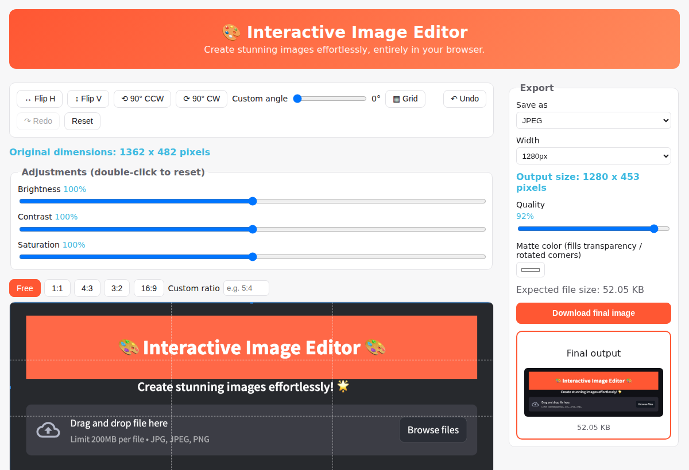

# 🎨 Interactive Image Editor

**Live demo: https://denimpatel.github.io/Image-editor/**

[](https://github.com/DenimPatel/Image-editor/actions/workflows/deploy.yml)

A fast, free, entirely client-side photo editor with an iOS-Photos-style, canvas-first
interface. Everything runs on your device: no uploads, no accounts, and no server.



## ✨ What it can do

- **Non-destructive document model.** Flip/rotate, straighten, crop, colour, curves, looks,
  layers and local adjustments are all stored as data and re-rendered on demand, so undo/redo
  and IndexedDB sessions are exact. Rotating or flipping keeps your crop instead of discarding it.
- **WebGL2 render pipeline** with a Canvas2D fallback. Orientation, perspective, straighten and
  crop collapse into one resample; preview renders from a viewport-sized proxy so a 48 MP photo
  costs the same as a 2 MP one.
- **Crop & straighten** with corner handles, pinch-zoom/pan, a ±45° dial with auto-zoom, safe-area
  guides for Story/Reel/YouTube, and a full preset catalogue: ratios, Instagram/TikTok/LinkedIn/X/
  Facebook/YouTube/Pinterest sizes, and print sizes (4×6, 5×7, 8×10, A4, A5 at your chosen DPI).
- **15 adjustments** — exposure, brilliance, highlights, shadows, contrast, brightness, black
  point, saturation, vibrance, warmth, tint, sharpness, definition, noise reduction and vignette —
  plus a live histogram, an **Auto** button driven by a real luminance histogram, a **curves**
  editor (monotone spline → 256-LUT) and 8-band **HSL colour mix**.
- **Looks/filters**: ~24 LUT presets in film families with a strength slider (LUT assets are
  fetched lazily from `public/luts/`).
- **Layers**: text with self-hosted fonts, shapes, stickers, vector drawing, redaction
  (baked into the exported pixels), watermarks and frames. Layers live in cropped-output space,
  so they survive a re-crop.
- **Background removal** via `@imgly/background-removal`'s ISNet matting model, with
  solid/gradient replacement and a keep-transparent PNG mode. Weights stream from imgly's CDN
  on first use and are cached by the browser afterwards.
- **Passport photos**: US 2×2, India, UK, Schengen, Canada, Australia, China, Japan, US visa, OCI
  and generic 35×45 specs, with a compliance checklist (head height, eye line, centring,
  background uniformity and effective DPI) and a printable sheet at exact physical page size.
- **Export**: JPEG, PNG, WebP, AVIF (feature-probed) and PDF; quality with a live size readout and
  a **“fit under N KB”** binary search; metadata strip/keep-orientation/keep-all; real DPI written
  into the file (JFIF density, PNG `pHYs`); share, copy-to-clipboard and multi-size zip.
- **iOS-like shell**: a full-bleed canvas, a scrollable tool tab bar, parameter rings with progress
  dials, a bottom sheet on mobile that becomes a right-hand inspector on desktop, press-and-hold to
  compare the original, and keyboard shortcuts (`?` shows them all).

## 🌟 Getting started

### Prerequisites

- [Node.js](https://nodejs.org/) 20+

### Installation

```bash
git clone https://github.com/DenimPatel/Image-editor.git
cd Image-editor
npm install
npm run dev
```

Then open the printed local URL and add `#/` … or just visit `/editor`.

### Optional ML weights and LUTs

`npm run models:fetch` only covers the face-landmark model: its weights are **not committed**
(they would bloat the repo and GitHub Pages must not serve Git LFS pointers), so they're pinned
in `models.lock.json` and downloaded into gitignored `public/models/`:

```bash
npm run models:fetch        # no-op when already present
REQUIRE_MODELS=1 npm run build   # fail the build if weights are missing
```

Background removal is unrelated to this script: `@imgly/background-removal` is a real
dependency that fetches its own weights and onnxruntime-web wasm from its CDN
(`staticimgly.com`) the first time the feature runs, and the browser caches them after that. If
the download fails (offline, or the CDN is blocked), the button shows a clear error and the
manual background-replacement/repair-brush fallback still works. LUT look PNGs are read lazily
from `public/luts/`.

### Scripts

```bash
npm run dev         # Vite dev server
npm run build       # tsc -b + production build
npm run lint        # ESLint
npm run typecheck   # TypeScript project build
npm test            # Vitest (pure/unit tests, jsdom)
npm run models:fetch
```

## 🏗️ Architecture

| Area | Location | Notes |
| --- | --- | --- |
| Document model | `src/model/` | JSON-serializable `Doc` (schema 3); assets referenced by id only |
| State | `src/store/` | zustand + a pure history engine with drag coalescing |
| WebGL2 | `src/gl/` | capabilities, passes, shaders, tiling, renderer |
| Fallback | `src/render/fallback2d.ts` | Canvas2D backend behind the same interface |
| Features | `src/features/` | crop presets, layers, ML, passport, export |
| UI | `src/components/` | canvas, controls, editor shell, tool panels |

The one rule that keeps everything simple: a `Doc` never contains an `ImageBitmap`, `Blob` or
canvas — only string asset ids into `AssetStore`. History, persistence, context-loss recovery and
copy/paste-edits all fall out of that.

## 🧪 Testing

`npm test` runs fast, jsdom-only unit tests over every decision that can be made pure: crop
geometry, sizing, history coalescing, curves/HSL/auto, pass planning and tiling, passport framing/
compliance/sheets, DPI/EXIF byte surgery, target-bytes search, layer z-order, and the model loader.
Shader correctness on real GPUs is exercised separately (see below).

## 🚧 Non-goals

Batch processing of many files at once is explicitly out of scope — it needs a different app shell.
“Copy edits / paste edits” plus multi-size export cover most of that need. Also out of scope: ML
super-resolution, HEIC decode, RAW, video and generative fill.

## 🗺️ Roadmap

- Playwright smoke suite (Chromium + WebKit, forced WebGL context loss, golden shader pixels).
- Face-landmark-driven portrait retouch (smoothing, healing, whitening, red-eye) on top of the
  existing local-adjustment masks.
- Manual matte-repair brush for background edges.

## License

See [LICENSE](LICENSE).
