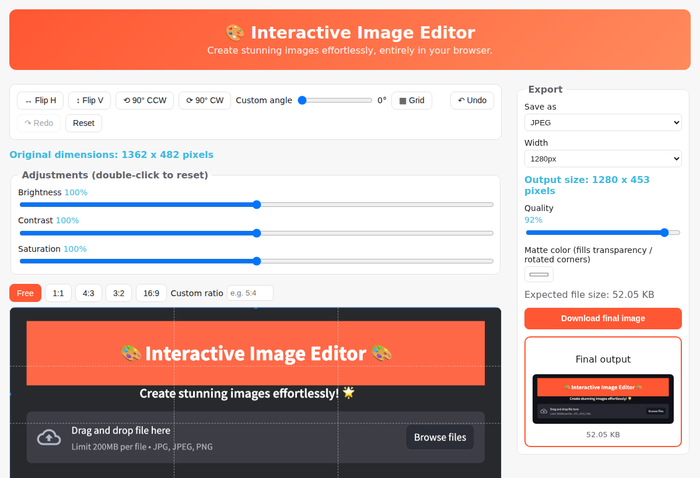

# 🎨 Interactive Image Editor

**Live demo: https://denimpatel.github.io/Image-editor/**

[](https://github.com/DenimPatel/Image-editor/actions/workflows/deploy.yml)

A fast, free, entirely client-side photo editor with an iOS-Photos-style, canvas-first
interface. Everything runs on your device: no uploads, no accounts, and no server.



The feature catalogue — **179 features, each with a status and a named test that would fail
without it** — is [`docs/FEATURES.md`](docs/FEATURES.md). Where the two disagree, the catalogue is
the one that was checked against the tree.

## ✨ What it can do

- **Non-destructive document model.** Flip/rotate, straighten, crop, colour, curves, looks,
  layers and local adjustments are all stored as data and re-rendered on demand, so undo/redo
  and IndexedDB sessions are exact. Rotating or flipping keeps your crop instead of discarding it.
- **WebGL2 render pipeline** with a Canvas2D fallback. Orientation, perspective, straighten and
  crop collapse into one resample; preview renders from a viewport-sized proxy so a 48 MP photo
  costs the same as a 2 MP one. The two backends are held to within about 2/255 per channel per
  pass family by a parity suite, and the one pass Canvas2D cannot express (a 3D LUT) is gated in
  `src/gl/caps.ts` rather than discovered at runtime.
- **Crop, straighten & perspective** with nine handles (four corners, four edges and a move
  gesture), pinch-zoom/pan, a ±45° dial and a **“Fill frame after straighten”** button that
  reflows the crop around the rotation, a 4-corner perspective warp you pull one corner at a
  time, safe-area guides for Story/Reel/YouTube, and a full preset catalogue: ratios,
  Instagram/TikTok/LinkedIn/X/Facebook/YouTube/Pinterest sizes, and print sizes (4×6, 5×7, 8×10,
  A4, **A3** — there is no A5) at your chosen DPI. The ratio chips draw the shape rather than
  printing a code, in the camera-viewfinder convention every phone uses.
- **15 adjustments** — exposure, brilliance, highlights, shadows, contrast, brightness, black
  point, saturation, vibrance, warmth, tint, sharpness, definition, noise reduction and vignette —
  each with its own mark on its own dial — plus a live histogram, an **Auto** button driven by a
  real luminance histogram, a **curves** editor (monotone spline → 256-LUT, four colour-coded
  channels) and 8-band **HSL colour mix** with a swatch per band.
- **Looks/filters**: 24 LUT presets in film families with a strength slider. Every chip is a
  **committed thumbnail** — one fixed synthetic scene, graded 24 ways — so two looks can be
  compared instead of read. The 24 look strips are **committed** to `public/luts/`, regenerated by
  `npm run luts:gen` and byte-checked by `npm run build`; a strip that cannot be decoded says so
  instead of silently applying nothing.
- **Layers**: text with 14 self-hosted fonts (a font that fails to load is badged
  “unavailable” in the picker), shapes, the built-in sticker set plus your own PNG/JPEG/WebP/GIF/
  AVIF sticker uploads, vector drawing, redaction (baked into the exported pixels), watermarks and
  frames. Layers live in cropped-output space, so they survive a re-crop.
- **Background removal** via `@imgly/background-removal`'s ISNet matting model, with solid,
  gradient or **image** replacement (fill-frame or fit-inside, plus a blur) and a keep-transparent
  PNG mode. Weights stream from imgly's CDN on first use and are cached by the browser afterwards.
  The panel says so when a replacement cannot show through yet: every replacement needs a matte,
  and the matte is what removes the background.
- **Retouch**: skin smoothing, spot healing and red-eye, with a pad that writes the point it
  landed on, a spot list you can remove from by name, and a `Reset` that is disabled until there
  is something to reset. This tab used to be a placeholder paragraph under an affordance that
  looked like a peer of Crop; it now writes `Doc.retouch` and the passes run on both backends.
- **Local adjustments**: a `mask`/`localAdjust` model, a pass planner entry and both engines are
  plumbed and unit-tested, but **there is still no UI to place one**. Nothing in the app produces
  a masked local adjustment today, and this README does not claim otherwise.
- **Passport photos**: US 2×2, US visa, India, UK, Schengen, Canada, Australia, China, Japan, OCI
  and generic 35×45 specs — each chip named after the document it is — with a compliance checklist
  (head height, eye line, centring, background uniformity, background colour and effective DPI)
  that prints **the measurement and the requirement** for anything it fails, head auto-framing that
  needs no downloaded model, and a printable sheet at exact physical page size on 4×6, 5×7 or A4.
- **Export**: JPEG, PNG, WebP, AVIF (feature-probed) and PDF; quality with a live size readout and
  a **“fit under N KB”** binary search that either hits the budget or says it did not; metadata
  strip / keep-orientation; real DPI written into the file (JFIF density, PNG `pHYs`, WebP
  `VP8X`); share, copy-to-clipboard, a filename template and a multi-size zip. The background
  model is the one thing that is **not** self-hosted — see below.
- **iOS-like shell**: a full-bleed canvas, a scrollable tool tab bar, parameter rings with progress
  dials, a bottom sheet on mobile that becomes a right-hand **grid column** (not an overlay) on
  desktop, press-and-hold to compare the original, and keyboard shortcuts (`?` shows them all).
  Installed as a PWA with an offline shell; the service worker only registers over https and never
  on `localhost`/`127.0.0.1`.
- **Appearance settings**: theme (light/dark/system), density, text size, motion, icon size and
  one of four accents. They live in chrome — never in the document, never in undo — and they reach
  the page as six `<html>` data-attributes. All typography is `rem` off a `100%` root, so your
  browser's text size actually applies, with a 12 px legibility floor; every colour accent is
  contrast-measured on both the light and the dark ground.
- **Licences and attribution** for all 33 bundled works (14 fonts and 19 packages) at
  `/licenses.html`, reachable from the Hub footer and from the crash screen, with the OFL and
  Apache licence **texts shipped beside the files** rather than linked. That page also carries the
  AGPL decision as its own panel — see “Shipping AGPL”.

## 🌟 Getting started

### Prerequisites

- [Node.js](https://nodejs.org/) **24.21.0 or newer** — pinned in `.nvmrc` and enforced by
  `engines.node`, and both CI workflows read `.nvmrc` rather than repeating the number. If you are
  on an older Node, `npm install` tells you; nothing else in this README assumes a version.

```bash
nvm use        # reads .nvmrc
```

### Installation

```bash
git clone https://github.com/DenimPatel/Image-editor.git
cd Image-editor
npm install
npm run dev
```

Then open the printed local URL and add `#/` … or just visit `/editor`.

### Self-hosted assets, and the one thing that is not

The look strips (`public/luts/`), the look thumbnails (`public/look-thumbs/`), the app icons and
the 14 woff2 font subsets (`public/fonts/`) are **meant to be committed**, so a fresh clone renders
and typesets correctly with no download step — 5.79 MB in total, under a byte budget that fails the
build if it grows. They are generated rather than hand-edited, and the build refuses to ship a
tree where a catalogue entry has drifted from its file:

> **As the tree stands they are untracked.** `git status --porcelain public/` lists all of them.
> `npm run build` reads the working tree and passes either way, so the build cannot tell you this
> is wrong; only `git status` can. See “Known release blockers”.

```bash
npm run assets:check              # verify what is on disk, and regenerate-check every generator
npm run luts:gen                  # regenerate the 24 look strips
npm run thumbs:gen                # regenerate the 24 look thumbnails
npm run icons:gen                 # regenerate the PWA icons
npm run assets:fetch              # re-download the 14 fonts, verified against their sha256
npm run assets:verify             # the verification half on its own
REQUIRE_ASSETS=1 npm run build    # hard-fail instead of warn on a missing asset
```

`models.lock.json` pins every one of those files by sha256 and its licence, and
`scripts/verify-assets.mjs` fails the build if the lock file and `src/features/layers/fonts.ts`
disagree. Its `models` section is **empty on purpose**: the app self-hosts no ML weights any more.
The passport auto-framer finds the head with a plain-background pixel detector instead of a
face-landmark model, so there is nothing to download for it.

> **Honest note on the guard.** `npm run build` runs `assets:check` first and `verify-assets.mjs`
> exits non-zero on a failure, so a missing asset **does** stop the build. But `npm run build`
> does **not** set `REQUIRE_ASSETS=1` itself — that variable only changes the _downloader_
> (`scripts/fetch-models.mjs`, which `prebuild` runs) from warning to failing. Two script comments
> claim otherwise; see “Known inaccuracies” below.

Background removal is the one feature that is not self-hosted.
`@imgly/background-removal` is a real dependency that streams its own ONNX weights and
`onnxruntime-web` wasm from imgly's CDN (`staticimgly.com`) the first time the feature runs — about
42 MB for the fast model, 84 MB for best-quality — and the browser caches them afterwards. That
fetch tells imgly this visitor's IP address, user agent and origin; the disclosure says so **in the
claim itself**, on the import screen and in the first-run orientation, not behind the button that
causes it. If the download fails (offline, or the CDN is blocked), the button says so and the manual
background-replacement fallback still works. There is no way to point that library at local
weights, which is why the panel names the CDN rather than implying the bytes are ours.

### 🚨 Shipping AGPL: an open decision, not a credit line

**This section is here because the README has lied in this project's history, and the honest form
of the sentence is the uncomfortable one.**

`@imgly/background-removal@1.7.0` is **AGPL-3.0**. The package's own `LICENSE.md` opens with the
GNU Affero General Public License v3; there is no MIT anywhere in it. It is a runtime dependency,
dynamically imported by the Background tool, linked into the same bundle as this application's own
MIT code. `src/lib/licenses.ts` names it ahead of the counts for exactly that reason, and
`/licenses.html` renders the whole decision as its own panel.

**Who owes what.** An end user who merely runs the hosted app is a **user** of the AGPL, not a
conveyer — running it is not distribution, so the everyday visitor owes nothing. Anyone who
**distributes this build** is conveying a combined work (this application plus the AGPL library
linked into it) and owes the corresponding source under **AGPL §5(a)**. §13 additionally brings a
hosted _modified_ deployment into scope, so “it only runs on GitHub Pages” is a distribution
question, not an exemption.

**The three options, and what each costs. This repository does not choose — that is an owner's
decision about licensing, hosting and product scope, and it is recorded rather than quietly
resolved in a comment:**

| Option                     | What it costs                                                                                                                                                                                                                                                                                                                                       |
| -------------------------- | --------------------------------------------------------------------------------------------------------------------------------------------------------------------------------------------------------------------------------------------------------------------------------------------------------------------------------------------------- |
| **Obtain permission**      | Ask imgly for a commercial licence, a relicence, or an explicit exemption. It may be granted and it may not, on their timetable. Until it is in writing the obligation stands. Nothing else has to change while the request is outstanding.                                                                                                         |
| **Replace the dependency** | Implement or license background removal another way. The only option that ends the obligation by removing its cause. Costs a matting model and a runtime — and the manual background-replacement path that already exists needs a matte to show through, and the matte is what this library produces. **The Background tool cannot ship as it is.** |
| **Publish the source**     | Oblige under §5(a): release this application's complete corresponding source with every distribution, including build scripts and recipient modifications. Own code stays MIT. Costs an ongoing obligation, and the ability to distribute the build as a closed product.                                                                            |

Until one of them is chosen, the true statement is: **the obligation exists and is unmet for anyone
who conveys this build.** “Anyone redistributing this build should read the upstream licence before
shipping it” — what this file used to say — is advice, and advice discharges an obligation under no
licence at all.

### Scripts

```bash
npm run dev             # vite dev server (loopback only)
npm run dev:host        # the same, on 0.0.0.0:5173 with --strictPort, so a phone can open it
npm run build           # assets:check && tsc -b && vite build && check-bundle && check-public-budget
npm run preview         # serve the built bundle
npm run preview:host    # the same, on 0.0.0.0:4173, against the built bundle
npm run lint            # ESLint, over src/, e2e/ and scripts/
npm run typecheck       # tsc -b
npm test                # Vitest: 2974 tests in 148 files, jsdom
npm run test:coverage   # the same, plus the per-area thresholds in vite.config.ts
npm run test:e2e        # Playwright: 623 cases in 38 spec files, own dev server on 5317
npm run test:e2e:chromium # the same, one project — the fast local loop
npm run assets:check    # every committed asset exists, hashes, and matches its generator
npm run assets:fetch    # re-download anything pinned in models.lock.json (alias: models:fetch)
npm run luts:gen        # regenerate the 24 look strips          (-- --check to verify only)
npm run thumbs:gen      # regenerate the 24 look thumbnails      (-- --check to verify only)
npm run icons:gen       # regenerate the PWA icons               (-- --check to verify only)
npm run appearance:sync # rewrite the pre-paint appearance script in index.html from the model
npm run bundle:check    # route splitting: no re-imported route, no over-budget eager chunk
npm run public:budget   # public/ within its total, per-directory and per-file budget
npm run perf:check      # apply PERF_BUDGET to a captured frame report
npm run format          # prettier --write .
npm run format:check    # prettier --check .
```

`npm run assets:verify` (the verification half of `assets:check` on its own) and `npm run
models:fetch` are also present; `models:fetch` is the only backwards-compatible alias left in the
file.

`npx prettier --check .` is the CI gate, and it is **repo-wide in both workflows** — a scoped list
of paths is a gate that reads as a pass, because a file added outside the list is never checked.
`.prettierignore` keeps `dist/`, `coverage/`, `test-results/`, `playwright-report/`, `.kilo/` and
`public/models/` out.

## 🏗️ Architecture

| Area           | Location                   | Notes                                                            |
| -------------- | -------------------------- | ---------------------------------------------------------------- |
| Document model | `src/model/`               | JSON-serializable `Doc` (schema 3); assets referenced by id only |
| State          | `src/store/`               | zustand + a pure history engine with drag coalescing             |
| WebGL2         | `src/gl/`                  | capabilities, passes, shaders, tiling, renderer                  |
| Fallback       | `src/render/fallback2d.ts` | Canvas2D backend behind the same interface                       |
| Features       | `src/features/`            | crop presets, layers, ML, passport, export                       |
| UI             | `src/components/`          | canvas, controls, editor shell, tool panels                      |

The one rule that keeps everything simple: a `Doc` never contains an `ImageBitmap`, `Blob` or
canvas — only string asset ids into `AssetStore`. History, persistence, context-loss recovery and
copy/paste-edits all fall out of that.

## 🧪 Testing

Three suites, three jobs.

| Suite      | Command                 | What runs on                                       |
| ---------- | ----------------------- | -------------------------------------------------- |
| Unit       | `npm test`              | 2974 tests in 148 files, jsdom, `tsconfig`-checked |
| Coverage   | `npm run test:coverage` | the same, plus per-area thresholds enforced        |
| End-to-end | `npm run test:e2e`      | 623 cases in 38 spec files, real browser           |

`npm test` covers every decision that can be made pure: crop geometry, sizing, history
coalescing, curves/HSL/auto, pass planning and tiling, passport framing/compliance/sheets,
DPI/EXIF byte surgery, target-bytes search, layer compositing and z-order, the asset catalogue,
the icon system, the appearance model, and the panels' honest-failure paths. Coverage measured on
2026-10-03: **statements 89.14 %, branches 80.85 %, functions 88.63 %, lines 91.80 %** — with one
per-area threshold red (see “Known release blockers”), which is why this file does not say the
coverage gate is green.

The Playwright suite is the real matrix, not a single engine:

- **`chromium`** — the default project, launched with `--use-angle=metal --enable-gpu
--ignore-gpu-blocklist --enable-gpu-rasterization` so it asks for a real driver rather than
  Playwright's bundled SwiftShader. `testIgnore`s `/journey.mobile/`.
- **`webkit`** — the Safari-only `ImageBitmap` / `OffscreenCanvas` / clipboard behaviour. Also
  `testIgnore`s `/journey.mobile/`.
- **`mobile`** — Pixel 7 with `hasTouch` and `isMobile`, owning **`testMatch: /journey.mobile/`**,
  which is **two** specs — `journey.mobile.spec.ts` and `journey.mobile-touch.spec.ts`,
  **19 cases**. Not one: the pattern is a prefix, not a filename, and the touch spec was added
  under it. `(pointer: coarse)` (which the camera-capture button keys off) only resolves under a
  touch stack, and a one-finger drag needs CDP, which is Chromium-only.

All three run in CI. (`chromium` and `webkit` were the only legs until this pass; the `mobile`
project was configured, documented and badge-green while nothing in `.github/workflows/` selected
it.)

It owns its dev server on **port 5317**, so it never collides with a dev server you already have on 5173.

**Every skip has a named reason**, and no skip can be read as a pass:

| Skip                                          | Where                                                                |
| --------------------------------------------- | -------------------------------------------------------------------- |
| No WebGL2 context in this browser             | context loss, shader compile                                         |
| No `WEBGL_lose_context`                       | the forced context-loss journey                                      |
| **No real GPU** — records the renderer string | `shader-parity.spec.ts` (SwiftShader/llvmpipe)                       |
| WebKit aborts the IndexedDB blob write        | import-edit-export, onboarding, reload-loss, retouch, phone-extremes |
| Safari does not Tab to links by default       | `journey.shell.spec.ts` skip-link case                               |
| Not the matrix engine for this spec           | `a11y-matrix.spec.ts`, `a11y-keys`, `appearance`                     |
| `E2E_MATTING=1` (off by default, off in CI)   | the matting journey — it would pull ~42 MB                           |

**Both roadmap items from the previous revision of this file now exist and are gates:**

- `e2e/shader-compile.spec.ts` compiles **every exported fragment and vertex shader** on the real
  driver. This is the gate that makes the class of bug behind "every export with a background
  produced nothing" unable to ship again.
- `e2e/shader-parity.spec.ts` compares the real GLSL against the CPU twin (`runCpuPasses`) in a
  real WebGL2 context. It **skips on a software rasteriser and records the renderer string in its
  report**.
- `e2e/journey.context-loss.spec.ts` forces a genuine loss with `WEBGL_lose_context` on the
  interactive context, waits out the 10 s backoff, and asserts the replacement context is live and
  that the exported PNG is **byte-identical** to the one from before the loss.

These three are the argument for the whole approach, and the reason is in the changelog: the three
worst defects of this codebase — a black WebGL preview from an `RGBA8` target fed a `HALF_FLOAT`
payload, a `mat3` transpose that made every crop, rotate, flip and straighten wrong on WebGL2 while
being correct on Canvas2D, and a `vec4`-into-`vec3` type error that broke every export with a
background — were not reachable from jsdom at all. There is no environment in which a unit test
finds them.

`e2e/a11y.spec.ts` runs axe over WCAG 2.1 A/AA with an **empty** allowlist: fixing a defect means
deleting an entry, not adding a suppression. Ten cases over the Hub, the import screen, the
workspace, the tool sheets, the watermark inspector, the curves editor and this licences page, in
normal and forced-colours modes.

## 🆕 What's new

For a person who opens the app rather than the repository. The full, mechanism-level account is
[`docs/FEATURES.md` §10](docs/FEATURES.md#10-changelog); these are the changes, not the diffs.

**Things that used to be broken and are not any more**

- The desktop inspector is a **grid column**, not an overlay. It used to cover the top bar and all
  thirteen tool tabs at 1280×900, so the controls you need to change tool were underneath a panel.
- On a phone, the sheet's backdrop no longer intercepts touches. It used to sit over the entire
  visible canvas, which made all eight crop handles, all five layer grips and the crop box's own
  move gesture unreachable for exactly as long as a panel was open.
- A square crop lights **one** chip. It used to light eight, because nothing in the document records
  which platform preset a ratio came from — so the row now holds no selection and the generic row
  holds all of it.
- The 24 looks are 24 **different** looks. Six were within 4.5/255 RMS of each other on the
  thumbnail scene: the same look with a slider nudged.
- The **retouch** tab writes `Doc.retouch` instead of rendering a paragraph admitting it could not.
- The histogram scales against a 2 % plateau ceiling, so a blown sky cannot flatten the graph. The
  graph was arithmetically correct and unreadable.

**Things that did not exist**

- Appearance settings — theme, density, text size, motion, icon size, accent — in chrome, never in
  the document or undo. All six reach the page as `<html>` data-attributes from one generated
  pre-paint script.
- Live look thumbnails, generated from one synthetic scene graded 24 ways and committed.
- Ratio chips that **draw** the ratio instead of printing a code, in the viewfinder convention.
- On-canvas layer transform handles; nine crop handles; a passport panel that speaks in documents
  and millimetres and prints _the measurement and the requirement_ for anything it fails.
- A build label on the Hub footer and the crash screen, a bounded local diagnostics buffer with no
  network transport, four debug switches, a runtime frame budget, and a byte budget for `public/`.
- An attribution page for all 33 bundled works, reachable from both of those screens.

## 🩺 When something goes wrong

- **A build label you can quote.** The Hub footer and the crash screen both print
  `version (commit-sha)`, and the version is `define`d from `package.json` at build time, so it
  cannot drift from it.
- **Local diagnostics.** A bounded in-memory ring buffer (100 entries and 64 kB, whichever binds
  first) fed from `window.onerror`, `unhandledrejection`, a `console.error` wrapper that always
  calls through, the error boundary and the render fallback. **There is no transport**: nothing in
  it opens a socket or mints an identifier, and a test asserts that against the module's own
  source. Values reach it as strings, or as an `Error` of which only `name`, `message` and
  `stack` are read; everything else becomes a type name in brackets.
- **“Copy diagnostics”.** On the crash screen and in the Help overlay (`?`). Clipboard API first,
  a hidden field plus `execCommand('copy')` if that is refused, and if that is gone too the text
  selected on screen with the keys to copy it named. “Copied” is never claimed unless it happened.
- **Debug switches.** Four of them — `matting`, `export`, `engine`, `webgl` — set with
  `?features=` / `?off=` in the URL or from **Help → Debug switches**, which persists to
  `localStorage`. The URL wins over storage because a URL is the more deliberate of the two, and
  every non-default row names its own source. A flag id the registry does not declare is reported
  in the overlay rather than silently ignored.

## 🚧 Non-goals

Batch processing of many files at once is explicitly out of scope — it needs a different app shell.
“Copy edits / paste edits” plus multi-size export cover most of that need. Also out of scope: ML
super-resolution, HEIC decode, RAW, video and generative fill.

One thing this file previously promised and the code does **not** have: a repair brush for
background edges. The copy in the Background panel says so in those words. There is still no
control that places a local adjustment mask — the model and both render passes exist for it, and
the UI does not.

## 🗺️ Roadmap

- **The AGPL decision.** `@imgly/background-removal` is AGPL-3.0 and linked into this bundle.
  Anyone who distributes this build owes the corresponding source under AGPL §5(a). The three
  options and what each costs are written up in [`NOTICE`](NOTICE) and at `/licenses.html`; nobody
  has chosen. See “Shipping AGPL” below.
- Colour management — the export writes no `iCCP` chunk and a Display-P3 source is read as sRGB
  without being disclosed. `D4-F12`, still `Missing`.
- A text alternative for the histogram, and a GPU readback rather than a 2D `getImageData` over a
  160 px render. `D4-F11`, still `Partial`.
- Narrowing the render loop's `uiStore` subscription so a toast does not wake it. `D3-F25`.
- A decision on `public/models/face_landmarker.task`: nothing in `src/` references it and
  `models.lock.json` does not pin it, but `check-public-budget.mjs` exempts `models/` from the
  per-file cap on the assumption that anything there is pinned, and prints it as
  “sha256-pinned in models.lock.json”. Delete the file, or pin it and use it.

## ⚠️ Known release blockers

Three things a maintainer must resolve before this is a release, none of which a test can tell
you about:

1. **`npm run test:coverage` is currently red.** `src/pages/**` measures **37.4 % branches against
   a 38 threshold**. Every other per-area threshold passes. The fix is either tests in
   `src/pages/` or a deliberate, recorded lowering of that one number in `vite.config.ts` — which
   is the wrong default and should be argued for in writing if chosen.
2. **The committed-asset tree is not committed.** `public/luts/` (24 strips),
   `public/look-thumbs/` (24 thumbnails), `public/fonts/` (14 woff2 + the two licence texts),
   `public/licenses.html`, `public/sw.js`, `public/manifest.webmanifest` and the three PWA icons
   are **untracked**. `git status --porcelain public/` must be empty before release, or a fresh
   clone ships dead Look chips, browser-fallback text layers and no licences page. `npm run
build` passes either way, because it reads the working tree.
3. **The AGPL decision above is unmade.**

## 📜 Known inaccuracies

- `scripts/check-public-budget.mjs` prints `(pinned models) … exempt from the per-file cap;
sha256-pinned in models.lock.json` for `public/models/face_landmarker.task`. Nothing pins it —
  `models.lock.json`'s `models` array is empty. The claim comes from a hard-coded
  `PUBLIC_PINNED_PREFIXES = ['models/']` that assumes rather than checks. See the roadmap above.
- `scripts/gen-luts.mjs:12` refers to `npm run luts:check` in CI. There is no such script; the
  real commands are `npm run assets:check` and `npm run luts:gen -- --check`.
- `scripts/verify-assets.mjs` prints `Set REQUIRE_ASSETS=1 to make this a hard failure.` on a
  failure it has already made a hard failure: it exits non-zero either way, verified by deleting
  `public/luts/kodak-portra.png`. The variable only makes the _downloader_
  (`scripts/fetch-models.mjs`, which `prebuild` runs) fail rather than warn.

Neither of the last two affects the build, and neither is fixed here because this README does not
own source files.

## License

MIT — see [LICENSE](LICENSE). That covers this code only. The 14 bundled fonts and the 19 bundled
packages ship under their own terms; see [NOTICE](NOTICE) and `/licenses.html`.
